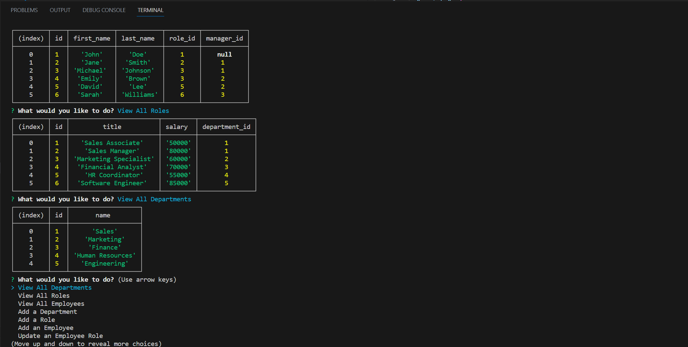

# Employee Tracker

## Description
Application that tracks employees by title, salary, department and management

## Installation
1. Clone this repository to your local machine or download it as a ZIP file and extract it.
2. Open a terminal or command prompt and navigate to the projects directory.
3. use 'NPM install' to install project dependencies

## Usage

1. Use MYSQL to run 'source schema.sql'
2. Use MYSQL to run 'source seeds.sql'
3. Use node to run 'index.js'
4. Navigate and select the options in the menu
EXAMPLE:
https://drive.google.com/file/d/1I4Xyh-bkh7fwM0AIT37JYyzdc_91bJms/view

## Credits

Chat GPT used for extra seeding
Inquirer
mysql2
sequelize

## License

N/A

## Visuals 

## Questions 
 If you have further questions you can reach me at averyjmyers@outlook.com or visit my GitHub profile at github.com/averyjmyers.